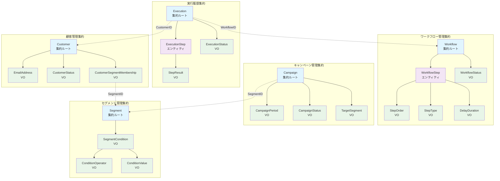

# LSTEP自動化システム ドメイン分析書

## 概要

本ドキュメントは、LSTEP（エルステップ）自動化システムのDDD（Domain-Driven Design）に基づくドメイン分析結果をまとめたものです。

## 業務要件分析

### LSTEP自動化システムとは

LSTEP自動化システムは、顧客との関係構築を自動化し、段階的にアプローチすることでコンバージョン率を向上させるマーケティング手法の実装システムです。

### 主要機能

1. **ステップメール配信**
   - 顧客の行動に応じた段階的なメール配信
   - トリガーベースの自動配信
   - パーソナライゼーション機能

2. **顧客セグメンテーション**
   - 顧客属性や行動データによる自動セグメント分類
   - 動的セグメント更新
   - セグメント別アプローチ戦略

3. **自動フォローアップ**
   - 設定したルールに基づく自動的な顧客フォローアップ
   - 条件分岐による複雑なワークフロー
   - タイミング制御

4. **分析・レポート**
   - Lステップの効果測定とパフォーマンス分析
   - コンバージョン率追跡
   - ROI分析

## 集約（Aggregate）設計

### 1. 顧客管理集約 (Customer Aggregate)

- **集約ルート**: Customer
- **責務**: 顧客情報の管理、セグメント所属の整合性保証
- **不変条件**: 
  - 顧客のメールアドレスは一意であること
  - アクティブな顧客のみがセグメントに所属できること
- **境界**: 単一顧客とその属性・セグメント所属情報

### 2. ワークフロー管理集約 (Workflow Aggregate)

- **集約ルート**: Workflow
- **責務**: ステップメール配信フローの整合性管理
- **不変条件**:
  - ワークフローには最低1つのステップが必要
  - ステップの順序は連続している必要がある
  - アクティブなワークフローのステップは削除できない
- **境界**: 1つのワークフローと関連するステップ群

### 3. 実行履歴集約 (Execution Aggregate)

- **集約ルート**: Execution
- **責務**: 個別実行インスタンスの状態管理
- **不変条件**:
  - 実行は一意の顧客とワークフローの組み合わせ
  - 完了した実行は再開できない
  - ステップ実行順序は定義されたワークフローに従う
- **境界**: 単一実行インスタンスとその実行ステップ履歴

### 4. キャンペーン管理集約 (Campaign Aggregate)

- **集約ルート**: Campaign
- **責務**: マーケティングキャンペーンの統括管理
- **不変条件**:
  - キャンペーンは開始日 ≤ 終了日であること
  - アクティブなキャンペーンは削除できない
  - 対象セグメントは実際に存在すること
- **境界**: キャンペーン設定と実行統計

### 5. セグメント管理集約 (Segment Aggregate)

- **集約ルート**: Segment
- **責務**: 顧客セグメンテーション規則の管理
- **不変条件**:
  - セグメント条件は有効なルールである必要がある
  - 使用中のセグメントは削除できない
- **境界**: セグメント定義と条件設定

## エンティティとバリューオブジェクト設計

### 顧客管理集約

**エンティティ**:
- `Customer` (集約ルート)
  - ID, メールアドレス, 名前, 登録日時, ステータス
  - セグメント所属管理

**バリューオブジェクト**:
- `EmailAddress` - メールアドレスの検証ロジック
- `CustomerStatus` - アクティブ/非アクティブ/停止
- `CustomerSegmentMembership` - セグメント所属情報

### ワークフロー管理集約

**エンティティ**:
- `Workflow` (集約ルート)
  - ID, 名前, 説明, 作成日時, ステータス
- `WorkflowStep` 
  - ステップID, 順序, タイプ, 設定, 遅延時間

**バリューオブジェクト**:
- `StepOrder` - ステップ順序の検証
- `StepType` - メール送信/待機/条件分岐/アクション
- `DelayDuration` - 待機時間の設定
- `WorkflowStatus` - ドラフト/アクティブ/非アクティブ

### 実行履歴集約

**エンティティ**:
- `Execution` (集約ルート)
  - ID, 顧客ID, ワークフローID, 開始日時, ステータス
- `ExecutionStep`
  - ステップID, 実行日時, ステータス, 結果

**バリューオブジェクト**:
- `ExecutionStatus` - 待機中/実行中/完了/エラー/キャンセル
- `StepResult` - 成功/失敗/スキップ、詳細メッセージ

### キャンペーン管理集約

**エンティティ**:
- `Campaign` (集約ルート)
  - ID, 名前, 説明, 開始日, 終了日, ステータス

**バリューオブジェクト**:
- `CampaignPeriod` - 開始日≤終了日の検証
- `CampaignStatus` - 計画中/実行中/完了/中断
- `TargetSegment` - 対象セグメントの指定

### セグメント管理集約

**エンティティ**:
- `Segment` (集約ルート)
  - ID, 名前, 説明, 条件設定, 作成日時

**バリューオブジェクト**:
- `SegmentCondition` - セグメント条件のルール定義
- `ConditionOperator` - 等しい/含む/より大きい/より小さい
- `ConditionValue` - 条件値（文字列/数値/日付）

## ユビキタス言語

### 基本概念
- **LSTEP（エルステップ）**: 段階的な顧客アプローチによりコンバージョン率を向上させるマーケティング手法
- **リード**: メールアドレス等を登録した見込み客
- **プロスペクト**: より関心度の高い見込み客

### 顧客管理領域
- **顧客（Customer）**: システムに登録された個人・法人
- **セグメント（Segment）**: 特定の条件に基づく顧客の分類
- **セグメンテーション**: 顧客を属性や行動に基づいて分類する活動
- **オーディエンス**: 特定のキャンペーンの対象となる顧客群

### ワークフロー管理領域
- **ワークフロー（Workflow）**: 自動化された一連の処理手順
- **ステップ（Step）**: ワークフロー内の個別の処理単位
- **ステップメール**: ワークフローに基づいて配信される段階的メール
- **トリガー**: ワークフロー実行のきっかけとなるイベント
- **シナリオ**: 顧客の行動に応じた条件分岐を含むワークフロー

### 実行管理領域
- **実行（Execution）**: 特定顧客に対するワークフローの実行インスタンス
- **実行履歴**: 過去の実行結果と詳細情報
- **ステップ実行**: ワークフロー内の各ステップの実行記録
- **配信結果**: メール送信の成功/失敗/バウンス等の結果

### キャンペーン管理領域
- **キャンペーン（Campaign）**: 特定期間・対象に対するマーケティング施策
- **配信スケジュール**: キャンペーンの実行タイミング設定
- **コンバージョン**: 顧客が期待される行動を取ること
- **CTR（クリック率）**: メール内リンクのクリック率
- **開封率**: メールが開封された割合

### 分析・レポート領域
- **パフォーマンス**: キャンペーンやワークフローの効果指標
- **エンゲージメント**: 顧客の関与度・反応度
- **ROI（投資収益率）**: マーケティング投資に対する収益率
- **ファネル分析**: 顧客の購買プロセス段階別分析

### システム運用領域
- **自動化ルール**: システムが自動実行する業務ルール
- **スケジューラ**: 時間ベースの自動実行管理機能
- **通知**: システムからユーザーへのアラート・レポート配信
- **ダッシュボード**: 主要指標を一覧表示する管理画面

## ドメインモデル図

## 設計原則と制約

### DDD原則の適用

1. **集約境界の明確化**
   - 各集約は独立したトランザクション境界
   - 集約間は ID による参照のみ
   - 集約ルートのみが外部から操作可能

2. **不変条件の保護**
   - 各集約内の不変条件をコンストラクタとメソッドで保護
   - バリューオブジェクトによる値の妥当性保証

3. **ユビキタス言語の徹底**
   - ドメインエキスパートとの共通言語を実装に反映
   - ビジネス用語を直接コードで使用

### アーキテクチャ制約

1. **Clean Architecture準拠**
   - ドメイン層は技術的依存関係を持たない
   - 依存関係は内向き（ドメイン ← アプリケーション ← インフラ）

2. **技術実装方針**
   - バックエンド: Go + Echo + PostgreSQL
   - フロントエンド: Next.js + TypeScript + Tailwind CSS
   - インフラ: AWS (ECS/Fargate + RDS + S3 + CloudFront)

## 今後の実装指針

1. **Phase 2.2**: ドメイン層の実装（エンティティ・VO・リポジトリインターフェース）
2. **Phase 2.3**: アプリケーション層の実装（ユースケース）
3. **Phase 2.4**: インフラストラクチャ層の実装（DB・外部API連携）
4. **Phase 2.5**: Webインターフェース層の実装（HTTPハンドラ・フロントエンド）

各フェーズでは本ドメイン分析書に基づき、DDDの戦術設計パターンを適用して実装を進める。

---

**作成日**: 2025-08-16  
**作成者**: Claude Code (GitHub Actions)  
**バージョン**: 1.0  
**関連Issue**: #19 - Phase 2.1: LSTEP自動化システムドメイン分析